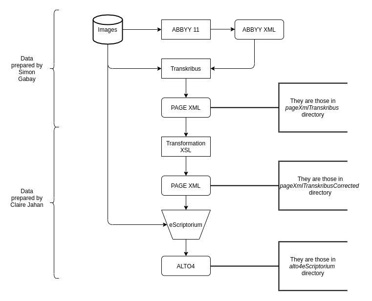
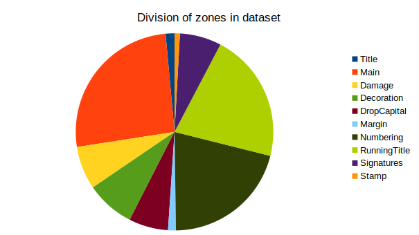
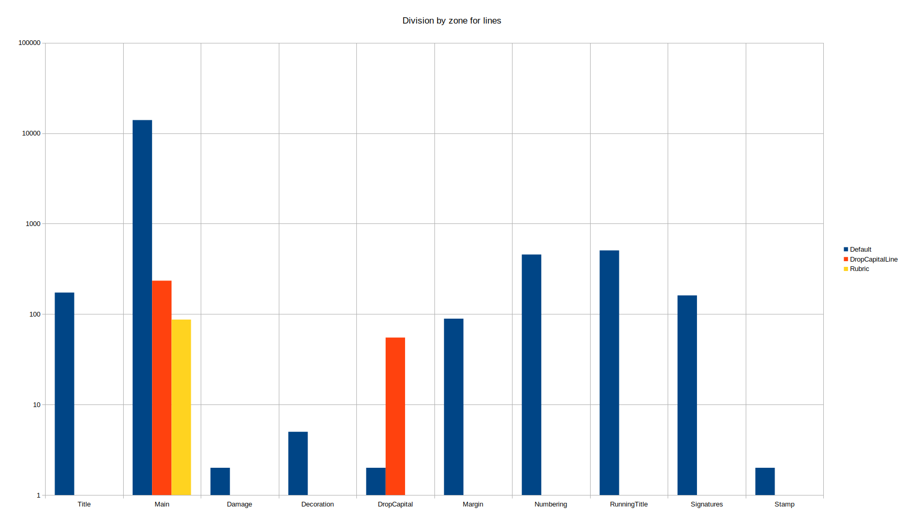

# OCR17+ - Additional data for information extraction of old French prints

Data for layout analysis and HTR.

## How to build the dataset
In your terminal, first use `build_train_alto_Seg17.sh` with a command bash.
Then, use the `python train_val_prep.py ./trainingDataSeg17/*.png`.

You will get a `trainingDataSeg17` directory containing all the data and two new files `train.txt` and `val.txt`.
The `test.txt` file is already prepared. We can test our training on the same test. It was created with 3 title pages, 14 pages containing damage, 2 pages with margin, 14 with decoration, 19 with rubric or signatures (or both), 1 with a running title on bottom of page, 3 pages with decorated drop capitals, 7 with basic drop capitals and 28 basic pages.

## Structure

```
├── Data
│     ├── Print_1
│     │  ├── alto4eScriptorium
│     │  ├── pageXmlTranskribus
│     │  ├── pagexmlTranskribusCorrected
│     │  └── png
│     ├── Print_2
│     │  ├── alto4eScriptorium
│     │  ├── pageXmlTranskribus
│     │  ├── pagexmlTranskribusCorrected
│     │  └── png
│     └── …
├── Models
|     ├── HTR
|     |	 └── htr_model.mlmodel
|     └── Segment
|        └── segment17.mlmodel
├── build_train_alto_Seg17.sh
├── files_informations.csv
├── parts_dataset.csv
├── train_val_prep.py
├── test.txt
└── README.md
```

The ``Data`` directory contains excerpts of 17<sup>th</sup> century books, _i.e._ scans of selected pages and their encoding in PageXML and ALTO-4 files.

The ``Models`` directory contains two trained models, one for HTR (more information [here]()) and the second for segmentation (more information [here](https://github.com/Heresta/datasetsOCRSegmenter17/blob/main/Model/Segment/README.md)).

* The files propose not only the transcription of the text but also a description of the layout using the [SegmOnto](https://github.com/SegmOnto) vocabulary.
* The old prints have been selected in the [OCR17 repo](https://github.com/e-ditiones/OCR17), and are all described individually in their respective folder.

``build_train_alto_Seg17.sh`` is a script to create a `.png` + ALTO4 dataset from all the print.

``files_informations.csv`` contains all names of dataset's files sorted depending on their main specificity.

``parts_dataset.csv`` contains the percentage of each specificity in this dataset.

## Data production
Data used come from the [OCR17 repo](https://github.com/e-ditiones/OCR17), the composition of which started with [Transkribus](https://readcoop.eu/transkribus). For each print, we propose
1. export format (`pageXmlTranskribus`)
2. its prepared form for eScriptorium (`pagexmlTranskribusCorrected`)
3. the final version exported from eScriptorium (`alto4eScriptorium`)

<p align="center">
  
</p>

## About files' segmentation

### About zones:

Title: 39 (1.37%)

Main: 741 (26.1%)

Damage: 222 (7.82%)

Decoration: 207 (7.29%)

DropCapital: 166 (5.85%)

Margin: 45 (1.59%)

Numbering: 576 (20.29%)

RunningTitle: 621 (21.87%)

Signatures: 199 (7.01%)

Stamp: 23 (0.81%)

<p align="center">
  
</p>

### About lines:

Default: 17963 (97.8%)

DropCapitalLine: 311 (1.69%)

Rubric: 93 (0.51%)

### About lines in zone

Title:

- Default: 198

Main:

- Default: 16 277

- DropCapitalLine: 253

- Rubric: 92

Damage:

- Default: 2

- Rubric: 1

Decoration:

- Default: 5

DropCapital:

- Default: 3

- DropCapitalLine: 57

Margin:

- Default: 134

- DropCapitalLine: 1

Numbering:

- Default: 528

RunningTitle:

- Default: 618

Signatures:

- Default: 196

Stamp:

- Default: 2

<p align="center">
  
</p>

## Contacts
Claire Jahan : claire.jahan[at]chartes.psl.eu

Simon Gabay : Simon.Gabay[at]unige.ch

## Cite this dataset
Claire Jahan and Simon Gabay, _17<sup>th</sup> century printed books (ALTO, PAGE-XML and png)_, 2021, Paris: ENS Paris,  https://github.com/Heresta/datasetsOCRSegmenter17.

## Licence
Data is CC-BY, except images which come from Gallica (cf. [conditions d'utilisation](https://gallica.bnf.fr/edit/und/conditions-dutilisation-des-contenus-de-gallica)).


